STM32 F407 Discovery USB FSデバイスを作る
===

STM32の開発には、STマイクロエレクトロニクス提供のライブラリを使うのが効率的とされており、現在は LL API（Low-Layer Application Programming Interface）ソフトウェアが無償提供されています。  
さらに STM32CubeIDE という開発環境 (IDE) も同様に無償で使えるため、STM32CubeIDE と LL を使って開発します。

使用するハードウェアは STM32F4DISCOVERY です。  
秋月電子やRSコンポーネンツで 3000円程度 で購入できます。

# 解説内容

USB FSデバイスを作り PC との通信を行います。  

# 用意するもの

* [STM32F4DISCOVERY](https://www.st.com/ja/evaluation-tools/stm32f4discovery.html)
* USB mini-B ケーブル
* Micro USB micro-B ケーブル

# 開発環境

* MacBook Pro (13-inch, 2019, Four Thunderbolt 3 ports)  
* macOS Catalina バージョン 10.15.6
* [STM32CubeIDE](https://www.st.com/ja/development-tools/stm32cubeide.html) Version: 1.4.0


STM32CubeIDE のインストールには、STマイクロエレクトロニクスへのアカウント登録（無料）が必要です。  
インストーラを実行するだけで簡単にインストールできます。

# ソフトウェア開発手順

## コーディング前の準備

STM32CubeIDE を起動すると以下の画面が開きます。  
画面左の C/C++ Projects で右クリックし、 [New] → [STM32 Project] を選択します。

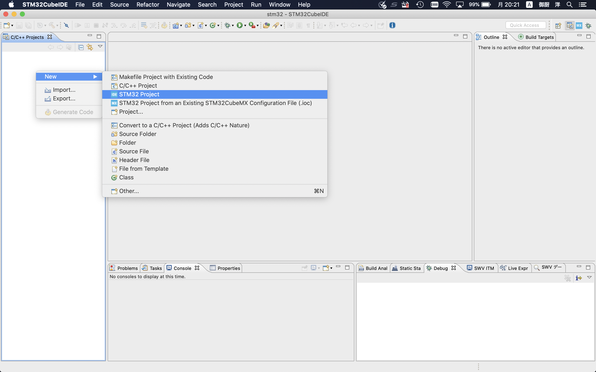

マイコンの種類を選択する画面が開きます。  
上バーから Board Selector を選び、 Commercial Part Number で STM32F407G-DISC1 を選択します。  
画面右にボードの写真が出てくるので選択し、右下の Next を押します。

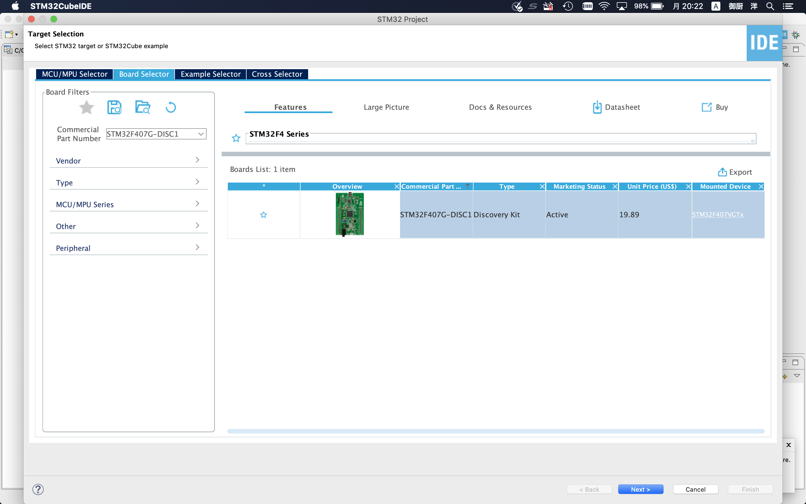 

Project Name を入力し、 Finish を押します。

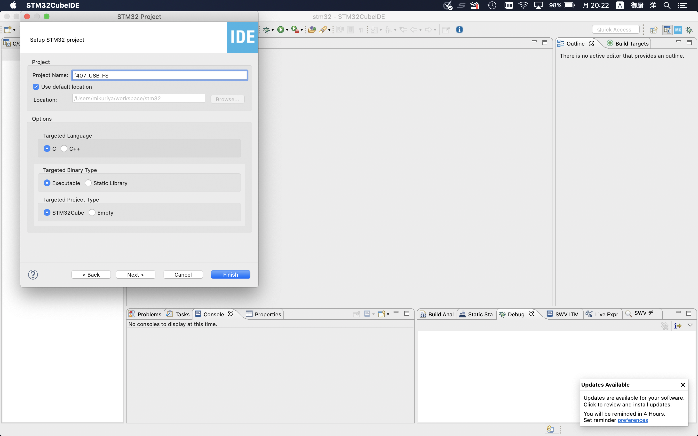

今回は No を選択します。  
（Yes を選択した方が楽なこともありますが勉強のため。）

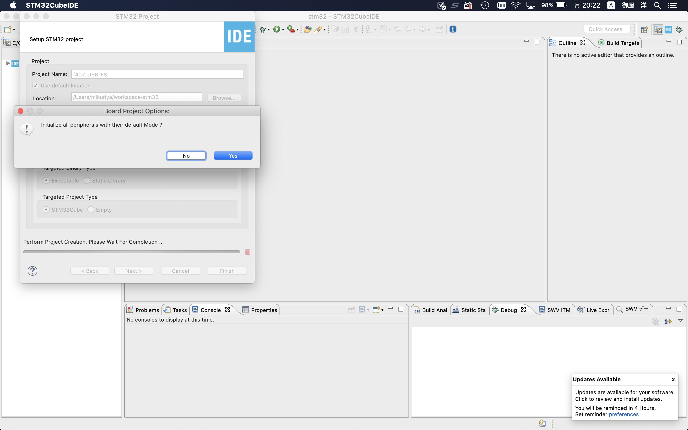

マイコンのピンアサイン画面が開きます。

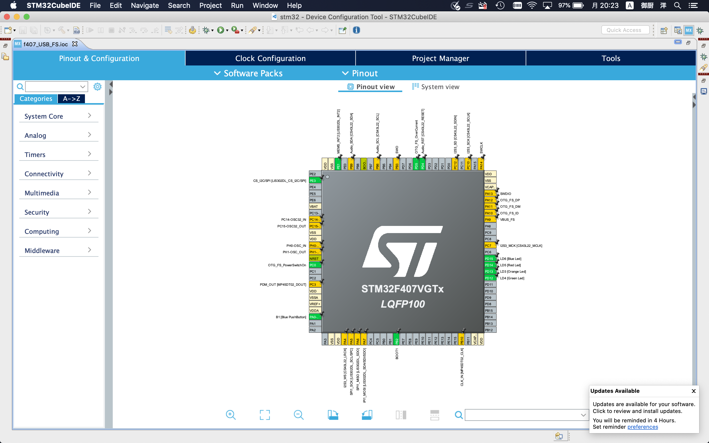

左蘭の [System Core] → [RCC] を選択します。  
High Speed Clock (HSE) を Crystal/Ceramic Resonator にします。  
F4Discoveryには 8MHz のオシレーターが付いているので、これを使うための設定です。  

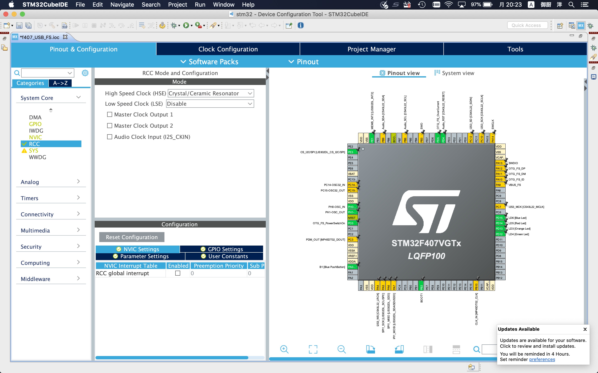

左蘭の [Connectivity] → [USB_OTG_FS] を選択します。  
Mode を Device_Only にします。

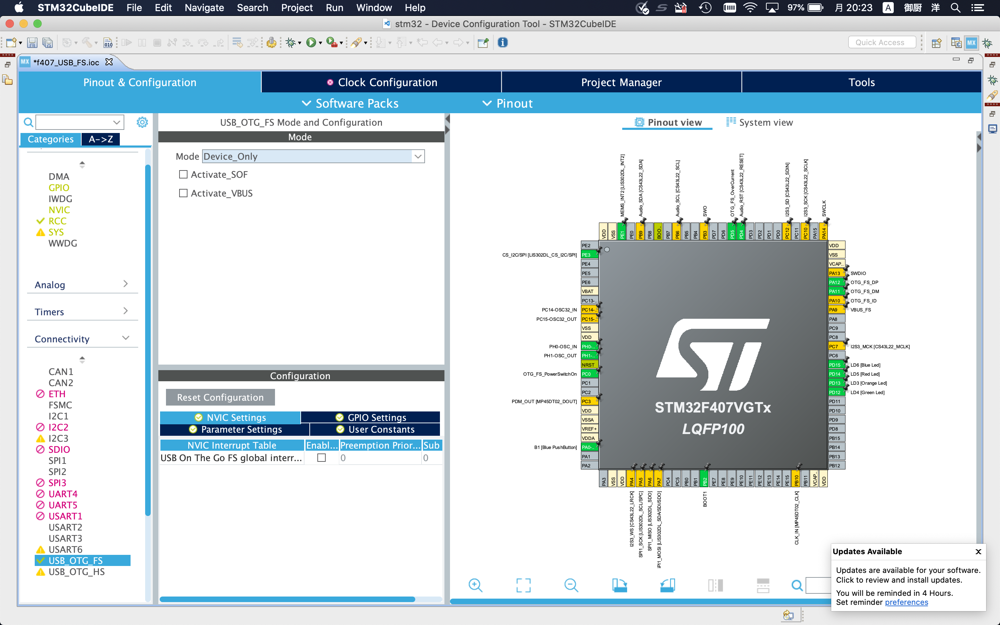

左蘭の [Middleware] → [USB_DEVICE] を選択します。  
Class For FS IP を Communication Device Class (Virtual Port Com) にします。

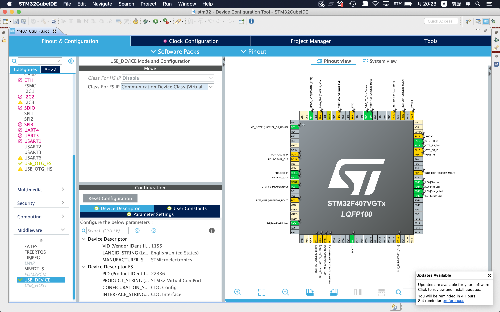

上タブの Clock Configuration を選択します。

本マイコンは 最大168MHz で動作します。  
また前述したとおり 8MHz のオシレーターが付いていますので、これを入力として逓倍と分周をして 168MHz を作り出すように設定します。  

以下画像のように設定してください。

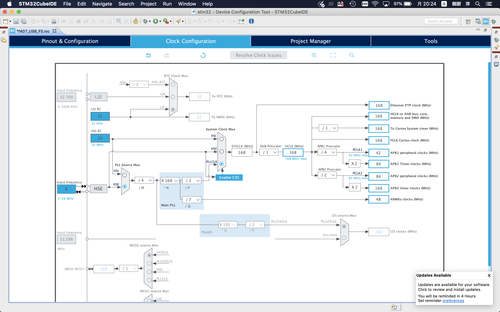

上タブの Project Maneger を選択します。  
次に左タブの Advanced Settings を選択します。

GPIO、RCC がデフォルトだと HAL となっていますが、 本記事は LL を推奨しているため LL を選択します。  
USB_DEVICE は HAL しか選択できないため、そのままです。

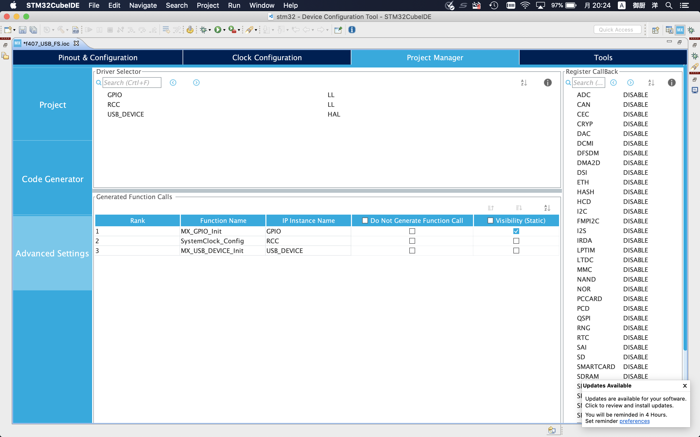

以上が設定できたら、 ioc ファイルを保存してください。  
保存すると自動的に C言語のファイル等必要なものが生成されます。

以上でコーディング前の準備は完了です。

## コーディング

USB_DEVICE/App/usbd_cdc_if.c の CDC_Control_FS に以下を追記してください。

```usbd_cdc_if.c
static int8_t CDC_Control_FS(uint8_t cmd, uint8_t* pbuf, uint16_t length)
{
  /* USER CODE BEGIN 5 */
  // 【追記開始】
  static uint8_t line[8] = {0};
  // 【追記終了】
  switch(cmd)
  {
  /**** 略 ****/
  case CDC_SET_LINE_CODING:
    // 【追記開始】
    for(uint16_t i = 0; i < length; ++i)
    {
      line[i] = pbuf[i];
    }
    // 【追記終了】
    break;

  case CDC_GET_LINE_CODING:
    // 【追記開始】
    for(uint16_t i = 0; i < length; ++i)
    {
      pbuf[i] = line[i];
    }
    // 【追記終了】
    break;
  /**** 略 ****/
  default:
    break;
  }

  return (USBD_OK);
  /* USER CODE END 5 */
}
```

USB_DEVICE/App/usbd_cdc_if.c の CDC_Receive_FS に以下を追記してください。

```usbd_cdc_if.c
static int8_t CDC_Receive_FS(uint8_t* Buf, uint32_t *Len)
{
  /* USER CODE BEGIN 6 */
  USBD_CDC_SetRxBuffer(&hUsbDeviceFS, &Buf[0]);
  USBD_CDC_ReceivePacket(&hUsbDeviceFS);
  // 【追記開始】
  CDC_Transmit_FS(Buf, *Len);
  // 【追記終了】
  return (USBD_OK);
  /* USER CODE END 6 */
}
```

以上でコーディングは完了です。

## 実行する

STM32F4Discovery を USB mini-Bケーブル で PC に繋いでください。

メニューバーから [Run] → [Debug] を選択します。  

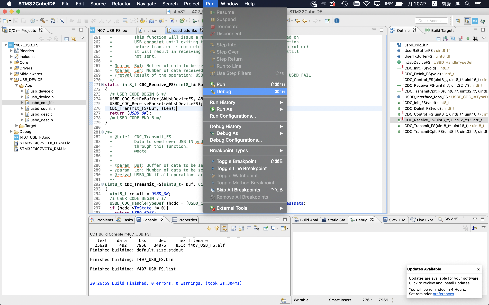

右下の OK を押します。

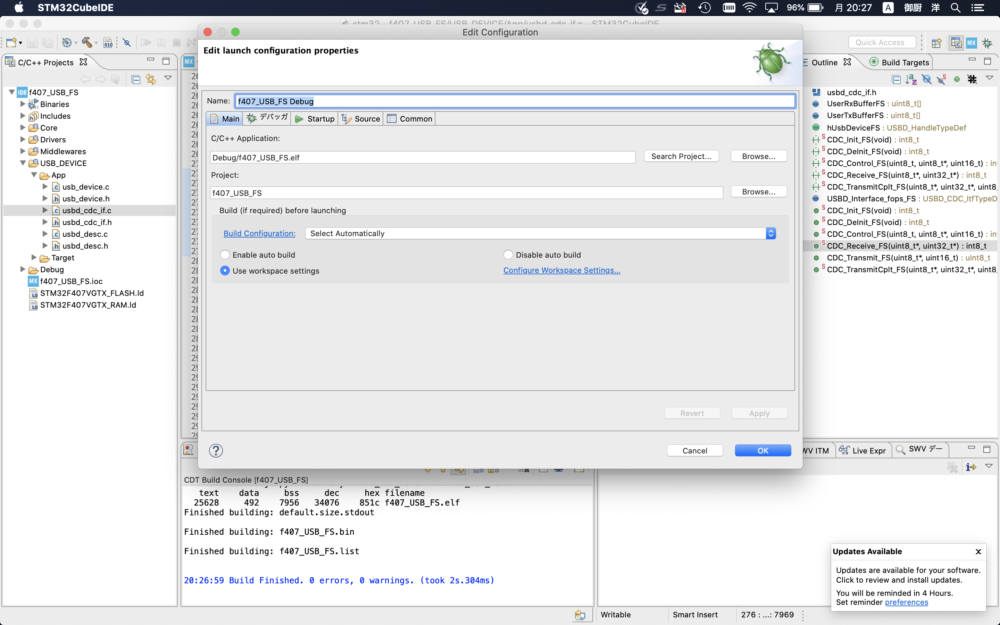

STM32F4Discovery に搭載されている ST-Link（JTAG）のバージョンが古いと以下画面が出るので最新にアップデートしてください。  
アップデート完了したら上記手順に戻り再度実行します。

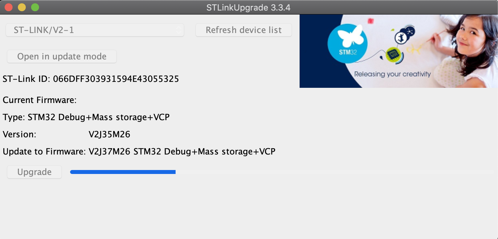

main関数の先頭で止まるので、左上の三角ボタンを押して続きを実行してください。  
（一行ずつのステップ実行なども可能です）

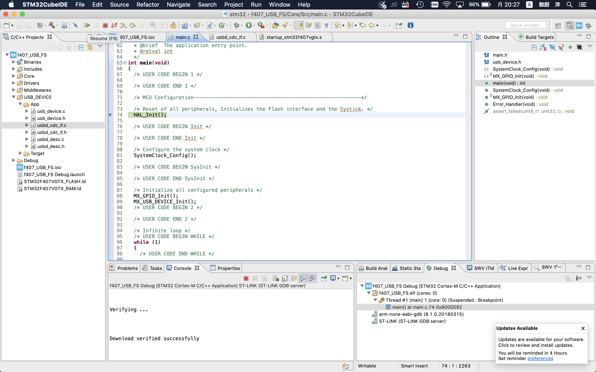

次に STM32F4Discovery を Micro USB micro-Bケーブル で PC に繋いでください。

TODO: 動作確認手順

以上で実行完了です。

## 解説

TODO: USB関数説明

# ソースコード一式

https://github.com/hiroshi-mikuriya/f407_USB_FS

# 参考

STマイクロエレクトロニクスのサンプルコード、および STM32CubeIDE が自動生成するコードを元に本記事を作成しています。